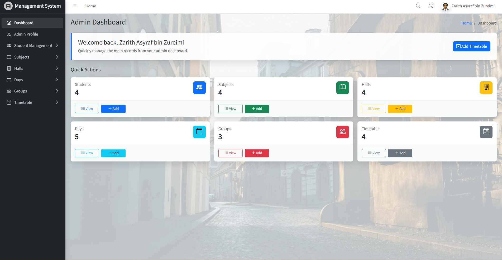
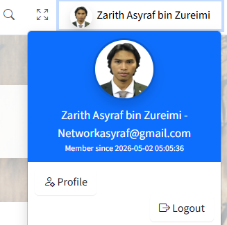

# Student Management System

A Laravel-based Student Management System developed for academic lab work.  
This project provides a simple web management system for managing students, subjects, lecture halls, days, lecturer groups, and timetable entries. The system also includes authentication, AdminLTE dashboard integration, CRUD operations, validation, route protection, dummy data seeding, and admin profile management.

---

## 📌 Project Overview

This system is designed as a web-based management platform for academic timetable and student data administration.

The system separates:

- **Admin/User account**: Used only for login and system access.
- **Student records**: Managed separately through the Student CRUD module.
- **Timetable lecturer data**: Retrieved from the lecturer name stored in the Subject module.

This separation ensures that registered admin users do not appear inside the Student List.

---

## 🚀 Features

### Authentication
- Admin login
- Register account
- Logout function
- Protected routes for logged-in users

### Dashboard
- AdminLTE dashboard layout
- Sidebar navigation
- User dropdown menu
- Admin profile display
- Dashboard card shortcut

### Student Management
- Add student
- View student list
- View student details
- Edit student
- Delete student
- Student data stored separately from admin login users
- Student email format example: `name@student.edu.my`

### Subject Management
- Add subject
- View subject list
- Edit subject
- Delete subject
- Store lecturer name for each subject

### Hall Management
- Add lecture hall
- View hall list
- Edit hall
- Delete hall

### Day Management
- Add day
- View day list
- Edit day
- Delete day

### Lecturer Group Management
- Add lecturer group
- View group list
- Edit group
- Delete group

### Timetable Management
- Add timetable entry
- View timetable entries
- Edit timetable entry
- Delete timetable entry
- Select lecturer name based on subject list
- Display lecturer name in timetable entries
- Hall conflict validation

### Admin Profile
- Edit admin name
- Edit admin email
- Change password
- Upload/change profile picture

---

---

## 📂 Main Modules

| Module | Description |
|---|---|
| Authentication | Admin login and registration |
| Dashboard | AdminLTE dashboard interface |
| Students | Manage student records |
| Subjects | Manage subjects and lecturer names |
| Halls | Manage lecture halls |
| Days | Manage class days |
| Groups | Manage lecturer groups |
| Timetables | Manage timetable entries |
| Profile | Manage admin profile |

---

